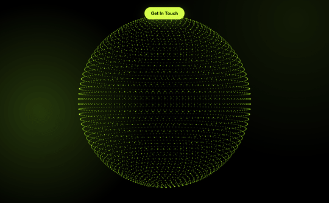

# 3D Dotted Globe

An interactive 3D dotted globe built with React, Three.js, and React Three Fiber. The globe auto-rotates at a uniform pace, the cursor cuts a hollow tunnel straight through both walls of the sphere, click-and-drag rotates it manually, and cursor velocity drives a physics-flavored response with a soft drift after motion stops.

<p align="center">
  
</p>

## Features

- **Per-dot GPU deformation** — auto-rotation, repel, and velocity physics all run in a single vertex shader. A typical run renders ~4,500 dots in one draw call at 60 FPS.
- **Hollow ray-distance repel** — distance is measured to the cursor's ray, not a point on the front of the sphere, so the hole clears both near and far walls.
- **Cursor-velocity physics** — fast cursor motion expands the affected zone, elongates it along the motion direction, and lingers briefly after the cursor stops (the "drift").
- **Drag-to-rotate** — `pointerdown` + drag rotates the globe; auto-rotation continues underneath, drag rotation is preserved on release.
- **Eased animations** — repel ramp uses a cubic S-curve, drag has a slight weighted lag, idle decay is smooth.
- **Responsive camera** — adjusts to viewport aspect so the globe always fits, portrait or landscape.
- **CSS-variable theming** — re-skin via `--globe-dot`, `--globe-glow`, `--globe-bg` on any parent.
- **Graceful WebGL fallback** — static SVG with the same color scheme if the browser can't run WebGL.

## Quick start

```bash
npm install
npm run dev      # http://localhost:5190
```

Other scripts:

```bash
npm run build        # type-check + production bundle
npm test             # unit + render tests
npm run test:watch   # vitest watch mode
npm run gif          # regenerate docs/media/globe-demo.gif (needs ffmpeg + Chrome)
```

## Using the component

```tsx
import { DottedGlobe } from './components/DottedGlobe';

export default function App() {
  return (
    <div style={{ width: '100%', height: '100vh', background: '#000' }}>
      <DottedGlobe />
    </div>
  );
}
```

### Props

All optional — sensible defaults are tuned to match the reference design.

| Prop | Default | Notes |
|---|---|---|
| `dotCount` | `4500` | Approximate; rounded to nearest ring-friendly value |
| `radius` | `1.6` | World units. Camera distance is auto-adjusted to fit |
| `rotationSpeed` | `0.22` | rad/sec (≈ 28 s per full rotation) |
| `repelRadius` | `0.45` | World units around the cursor ray |
| `repelStrength` | `0.55` | Maximum outward displacement |
| `dotSize` | `0.05` | Coefficient on perspective-scaled point size |
| `className` | `undefined` | Applied to the wrapping `<div>` |

### Theming

```css
:root {
  --globe-dot:  #d4ff4a;  /* dot color */
  --globe-glow: #aaff3a;  /* ambient glow */
  --globe-bg:   #000000;  /* background */
}
```

`--globe-dot` is read on mount and piped into the shader. The other two are pure CSS.

## Browser support

WebGL 1 — Chrome, Firefox, Safari, Edge (desktop and mobile). A static SVG fallback renders when WebGL is unavailable.

## Architecture

See [`ARCHITECTURE.md`](ARCHITECTURE.md) for the full breakdown: the GPU pipeline, the cursor-to-uniform data flow, how the velocity physics is modeled, and the trade-offs behind each choice.

For agent-driven contributions, see [`CLAUDE.md`](CLAUDE.md) — it lists the tunables, conventions, and the bugs we've already fixed (so they don't come back).

## Project layout

```
src/
├── main.tsx                       React entry
├── App.tsx                        Demo page
├── App.css                        Page theme + ambient glow
└── components/DottedGlobe/
    ├── index.tsx                  <DottedGlobe /> + <CameraRig />
    ├── GlobePoints.tsx            R3F <points> + per-frame logic
    ├── globe.vert.glsl            Vertex shader (rotation, repel, physics)
    ├── globe.frag.glsl            Fragment shader (soft dots + edge boost)
    ├── createRingPositions.ts     Pure function: dot positions + normals
    ├── usePointerNDC.ts           Pointer hook: NDC + drag + velocity
    ├── ErrorBoundary.tsx          Catches render errors → fallback
    └── WebGLFallback.tsx          Static SVG fallback

docs/
├── media/globe-demo.gif           The animation above
├── superpowers/specs/             Design spec
└── superpowers/plans/             Implementation plan
```

## Regenerating the demo GIF

```bash
npm run dev                # in one terminal
npm run gif                # in another
```

The `scripts/generate-gif.mjs` script launches headless Chrome via `puppeteer-core`, drives the cursor through a scripted choreography (idle → hover → flick → drag → release), captures 30 frames, and stitches them into `docs/media/globe-demo.gif` using `ffmpeg`.

Requires:
- `ffmpeg` on PATH (`brew install ffmpeg` on macOS)
- Google Chrome at `/Applications/Google Chrome.app`
- The dev server running at `http://localhost:5190`

## License

MIT.
